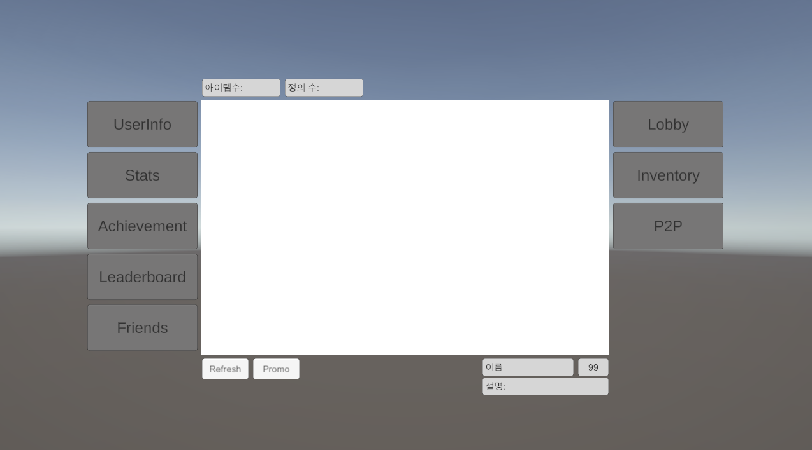

# Steamworks.NET Unity Demo

Steamworks API를 Unity에서 테스트하고 학습하기 위한 데모 프로젝트

SpaceWar (App ID: 480) 테스트 앱을 활용하여 Steam의 주요 기능들을 시각적으로 확인


## Features

- **Stats & Achievements**: 통계 저장/로드, 도전과제 해제/잠금
- **Leaderboards**: 순위표 생성, 점수 업로드, 전체/친구/주변 순위 조회
- **Friends**: 친구 목록, 온라인 상태, 게임 초대, Rich Presence
- **Matchmaking**: 로비 생성/검색/참가, P2P 패킷 송수신
- **Inventory**: 인벤토리 아이템 조회

## Code Structure

```
Assets/_SteamworksDemo/
├── Scripts/
│   ├── Core/                      # 인프라
│   │   ├── SteamManager.cs        # Steam 초기화/종료
│   │   ├── SteamLogger.cs         # 구조화된 로깅
│   │   ├── SteamEventBus.cs       # 이벤트 시스템
│   │   ├── ServiceBootstrapper.cs # 서비스 초기화 관리
│   │   └── ISteamService.cs       # 서비스 인터페이스
│   ├── Services/                  # Steam API 래퍼
│   │   ├── SteamUserService.cs
│   │   ├── SteamStatsService.cs
│   │   ├── SteamAchievementService.cs
│   │   ├── SteamLeaderboardService.cs
│   │   ├── SteamFriendsService.cs
│   │   ├── SteamLobbyService.cs
│   │   ├── SteamP2PService.cs
│   │   ├── SteamCloudService.cs
│   │   ├── SteamInventoryService.cs
│   │   └── SteamInputService.cs
│   ├── UI/                        # UI 레이어
│   │   ├── UIManager.cs
│   │   ├── TabController.cs
│   │   └── Panels/                # 각 기능별 패널
│   └── Data/                      # 데이터 모델
│       ├── UserData.cs
│       ├── StatData.cs
│       ├── AchievementData.cs
│       └── ...
└── steam_appid.txt                # App ID: 480
```

### Service Layer

| 서비스 | Steam 인터페이스 | 주요 기능 |
|--------|-----------------|----------|
| SteamUserService | ISteamUser, ISteamApps | 사용자 정보, 앱 상태 |
| SteamStatsService | ISteamUserStats | 통계 읽기/쓰기/저장 |
| SteamAchievementService | ISteamUserStats | 도전과제 해제/잠금 |
| SteamLeaderboardService | ISteamUserStats | 순위표 CRUD (CallResult 패턴) |
| SteamFriendsService | ISteamFriends | 친구 목록, Rich Presence |
| SteamLobbyService | ISteamMatchmaking | 로비 생성/검색/참가 (Callback 패턴) |
| SteamP2PService | ISteamNetworking | P2P 패킷 송수신 |
| SteamCloudService | ISteamRemoteStorage | 클라우드 파일 관리 |
| SteamInventoryService | ISteamInventory | 인벤토리 조회 |
| SteamInputService | ISteamInput | 컨트롤러 입력 |

## Setup

### 1. 요구사항

- Steam 클라이언트 실행 중
- `steam_appid.txt` 파일 (Assets 폴더에 포함됨)

### 2. Scene 설정 (SteamworksDemoScene 참고)

1. 빈 GameObject 생성 → `SteamManager` 스크립트 추가
2. 빈 GameObject 생성 → `ServiceBootstrapper` 스크립트 추가
3. Canvas 생성 → UI 패널 구성

### 3. 실행 확인

Play 모드 실행 → Console에서 로그 확인:
```
[Steam:SteamManager] Steam 초기화 성공
[Steam:SteamManager] App ID: 480
[Steam:SteamManager] 사용자: YourName (76561198xxxxxxxxx)
```

## Usage Examples

### Stats 읽기/쓰기

```csharp
// Stats 값 가져오기
int wins = SteamStatsService.Instance.GetStatInt("NumWins");

// Stats 값 설정
SteamStatsService.Instance.SetStatInt("NumWins", wins + 1);

// Steam 서버에 저장
SteamStatsService.Instance.StoreStats();
```

### Achievement 해제

```csharp
// 도전과제 해제
SteamAchievementService.Instance.UnlockAchievement("ACH_WIN_ONE_GAME");

// 도전과제 잠금 (테스트용)
SteamAchievementService.Instance.ClearAchievement("ACH_WIN_ONE_GAME");
```

### Leaderboard 점수 업로드

```csharp
// 리더보드 찾기/생성
SteamLeaderboardService.Instance.FindOrCreateLeaderboard("Spacewar", (success) =>
{
    if (success)
    {
        // 점수 업로드
        SteamLeaderboardService.Instance.UploadScore(1000, (uploaded, rank, changed) =>
        {
            Debug.Log($"순위: {rank}위");
        });
    }
});
```

### Lobby 생성/참가

```csharp
// 공개 로비 생성
SteamLobbyService.Instance.CreatePublicLobby(4, (success, lobbyId) =>
{
    if (success)
    {
        SteamLobbyService.Instance.SetLobbyName("My Lobby");
    }
});

// 로비 검색
SteamLobbyService.Instance.SearchLobbies((lobbies) =>
{
    foreach (var lobby in lobbies)
    {
        Debug.Log($"{lobby.Name}: {lobby.CurrentMembers}/{lobby.MaxMembers}");
    }
});
```

### P2P 메시지 전송

```csharp
// 특정 대상에게 전송
SteamP2PService.Instance.SendMessage(targetSteamId, "Hello!");

// 로비 전체에 브로드캐스트
SteamP2PService.Instance.BroadcastMessage("Hello everyone!");

// 수신 이벤트 구독
SteamEventBus.OnP2PPacketReceived += (senderId, data) =>
{
    string message = System.Text.Encoding.UTF8.GetString(data);
    Debug.Log($"받은 메시지: {message}");
};
```

## SpaceWar Test Data

### Stats (App ID 480)

| Stat ID | 설명 | 타입 |
|---------|------|------|
| NumGames | 총 게임 수 | Int |
| NumWins | 승리 횟수 | Int |
| NumLosses | 패배 횟수 | Int |
| FeetTraveled | 누적 이동 거리 | Float |
| MaxFeetTraveled | 최대 이동 거리 | Float |

### Achievements (App ID 480)

| Achievement ID | 설명 |
|----------------|------|
| ACH_WIN_ONE_GAME | 첫 승리 |
| ACH_WIN_100_GAMES | 100번 승리 |
| ACH_TRAVEL_FAR_ACCUM | 누적 10,000 feet 이동 |
| ACH_TRAVEL_FAR_SINGLE | 한 게임에서 500 feet 이동 |

## Architecture

### Callback vs CallResult

```
Callback<T>     : Steam 이벤트 자동 수신 (친구 상태 변경, 로비 입장 등)
CallResult<T>   : 비동기 API 호출 결과 수신 (리더보드 조회, 로비 생성 등)
```

### Event Flow

```
Steam API → Callback/CallResult → Service → SteamEventBus → UI Panel
```

## Troubleshooting

### Steam/SDK 버전 확인

Steamworks.NET은 특정 Steam 클라이언트 버전을 요구합니다. **둘 다 최신 버전으로 유지**하는 것이 안전합니다.

| 구성 요소 | 확인 방법 | 업데이트 |
|-----------|----------|----------|
| Steam 클라이언트 | Steam → Steam 정보 | Steam → Steam 업데이트 확인 |
| Steamworks.NET | Package Manager 확인 | 최신 버전으로 업그레이드 |

`No SteamClient0XX` 오류는 Steam 클라이언트가 SDK가 요구하는 인터페이스 버전을 지원하지 않을 때 발생합니다.

### Unity 재시작 필요성

Steam API는 **프로세스 시작 시점**에 Steam 클라이언트와 IPC 연결을 설정합니다.

| 상황 | Unity 재시작 필요 |
|------|------------------|
| Steam 업데이트 후 | ✅ 필수 |
| Steam 실행 후 | ✅ 권장 (Unity가 먼저 실행된 경우) |
| Play 모드 재시작 | ❌ 불필요 |

Unity Editor는 한 번 실행되면 Steam IPC 연결 상태를 유지합니다. Steam 클라이언트가 업데이트되거나 재시작되면 **Unity도 완전히 종료 후 재시작**해야 새 연결이 수립됩니다.

### Steam 실행 확인 (Mac/Linux)

```bash
# Steam 프로세스 확인
ps aux | grep -i steam | grep -v grep

# 실행 중이면 steam_osx 또는 steam 프로세스가 표시됨
```

### 일반적인 오류

| 오류 | 원인 | 해결 |
|------|------|------|
| `SteamAPI.Init() 실패` | Steam 미실행 | Steam 앱 실행 후 Unity 재시작 |
| `No SteamClient0XX` | SDK 버전 불일치 | Steam 클라이언트 업데이트 + Unity 재시작 |
| `Packsize 테스트 실패` | 빌드 설정 오류 | x64 아키텍처 확인 |
| `DllCheck 실패` | 라이브러리 누락 | Steamworks.NET 재설치 |
### 디버그 로그

Console에서 `[Steam:]` 태그로 필터링하면 Steamworks 관련 로그만 확인 가능:
- `[Steam:SteamManager]` - 초기화/종료
- `[Steam:Stats]` - 통계
- `[Steam:Achievement]` - 도전과제
- `[Steam:Lobby]` - 매치메이킹

## Environment

- Unity 6
- Steamworks.NET 2025.163.0
- Universal Render Pipeline (URP)

## References

- [Steamworks.NET](https://steamworks.github.io/)
- [Steamworks Documentation](https://partner.steamgames.com/doc/home)
- [SpaceWar Example](https://partner.steamgames.com/doc/sdk/api/example)

## License

MIT
